<!-- START doctoc generated TOC please keep comment here to allow auto update -->
<!-- DON'T EDIT THIS SECTION, INSTEAD RE-RUN doctoc TO UPDATE -->
**Table of Contents**  *generated with [DocToc](https://github.com/thlorenz/doctoc)*

- [Ruby on Rails 6: Authenticating Users in a Rails Application](#ruby-on-rails-6-authenticating-users-in-a-rails-application)
  - [Understanding Password Storage and Security in Ruby](#understanding-password-storage-and-security-in-ruby)
    - [Project Overview](#project-overview)
    - [Implementing User Verification](#implementing-user-verification)
    - [Implementing User Verification](#implementing-user-verification-1)
      - [Build Login Page](#build-login-page)
    - [Password Recovery](#password-recovery)
  - [Keeping Users Signed in with Secure Session Management](#keeping-users-signed-in-with-secure-session-management)
    - [Encrypted Cookies](#encrypted-cookies)

<!-- END doctoc generated TOC please keep comment here to allow auto update -->

# Ruby on Rails 6: Authenticating Users in a Rails Application

> My notes from Pluralsight [course](https://app.pluralsight.com/library/courses/rails-application-authenticating-users/table-of-contents)

Versions:

```bash
rbenv local
# 2.7.2

rails --version
# Rails 6.1.6
```

## Understanding Password Storage and Security in Ruby

### Project Overview

* Will be building a news feed website using Google's RSS platform
* Will limit how much content users can access depending on whether they're logged in:
  * Logged in users can view full articles
  * Guest users can only see limited content

### Implementing User Verification

Start by scaffolding a new Rails project, then start server, then verify at `http://localhost:3000/`:

```
rails new news
bin/rails s
```

Generate a homepage controller with an index method. This generates controller, view, helper, and styles:

```
bin/rails g controller Home index
create  app/controllers/home_controller.rb
 route  get 'home/index'
invoke  erb
create    app/views/home
create    app/views/home/index.html.erb
invoke  test_unit
create    test/controllers/home_controller_test.rb
invoke  helper
create    app/helpers/home_helper.rb
invoke    test_unit
invoke  assets
invoke    scss
create      app/assets/stylesheets/home.scss
```

Simple home view:

```erb
<!-- news/app/views/home/index.html.erb -->
<h1>Home</h1>
<p>This is the home page!</p>
```

Generator added route entry for get home page, let's also add a `root` entry so the home page is the default view:

```ruby
# news/config/routes.rb
Rails.application.routes.draw do
  get 'home/index'
end
```

Should look like this:

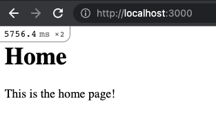

To get rss news displaying on home page, add [rss](https://rubygems.org/gems/rss) to Gemfile and `bundle install`:

```ruby
# news/Gemfile

# Family of libraries that support various formats of XML feeds
gem 'rss'
```

Add a view [helper](https://www.rubyguides.com/2020/01/rails-helpers/) to return rss feed for google news:

Example url for search for "macbook": `https://news.google.com/rss/search?q=macbook&hl=en-CA&gl=CA&ceid=CA%3Aen`

How to figure out [google news rss urls](https://www.aakashweb.com/articles/google-news-rss-feed-url/).

The `RSS::Parser.parse(rss)` method returns an array of items containing title, description, and publication date:

```ruby
# news/app/helpers/home_helper.rb
module HomeHelper
  def articles(query)
    require 'rss'
    require 'open-uri'
    # instructor's US feed
    # url = "https://news.google.com/rss/search?cf=all*h1=en-US&pz=1&q=#{query}&gl=US&ceid=US:en"
    # my Canadian feed
    url = "https://news.google.com/rss/search?q=#{query}&hl=en-CA&gl=CA&ceid=CA%3Aen"
    open(url) do |rss|
      RSS::Parser.parse(rss)
    end
  end
end
```

Update home view to use the `articles` helper method to search for "Google", and then iterate over the results.

Note about [raw](https://api.rubyonrails.org/v7.0.3/classes/ActionView/Helpers/OutputSafetyHelper.html#method-i-raw) view helper from Rails:

> This method outputs without escaping a string. Since escaping tags is now default, this can be used when you don't want Rails to automatically escape tags. This is not recommended if the data is coming from the user's input.

```erb
<!-- news/app/views/home/index.html.erb -->
<div class="articles">
  <h1>Articles</h1>
  <% articles('Google').items.each do |item| %>
    <div class="article">
      <h2><%= item.title %></h2>
      <p><%= raw item.description %></p>
      <p><%= item.pubDate %></p>
    </div>
  <% end %>
</div>
```

Add some custom styles to make each article look like a card:

```scss
// news/app/assets/stylesheets/home.scss
.articles {
  display: flex;
  flex-wrap: wrap;
  background-color: rgb(241, 241, 241);
  h1 {
    flex: 0 0 100%;
    text-align: center;
  }
}

.article {
  margin: 10px;
  padding: 20px;
  flex: 1 0 300px;
  background-color: white;
  box-shadow: 0 0 5px rgba(0,0,0,0.5);
  border-radius: 3px;
  display: flex;
  flex-direction: column;
  justify-content: space-between;
  h2 {
    margin: 0;
  }
  p {
    margin: 5px 0;
  }
}
```
Now homepage looks something like this:

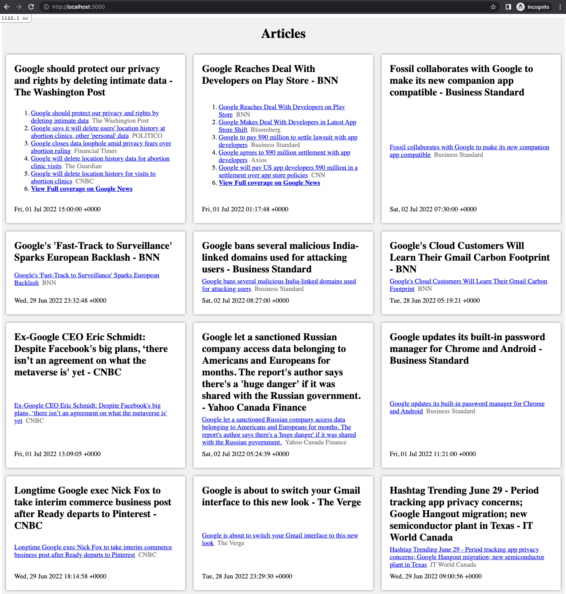

### Implementing User Verification

Generate a user model with username and password_digest fields. Note field name `password_digest`, not simply `password`, this will be used to interact with bcrypt gem:

```
bin/rails g model user username password_digest
invoke  active_record
create    db/migrate/20220702133354_create_users.rb
create    app/models/user.rb
invoke    test_unit
create      test/models/user_test.rb
create      test/fixtures/users.yml
```

Generate `users` controller with `new` and `create` methods:

```
bin/rails g controller users new create
create  app/controllers/users_controller.rb
 route  get 'users/new'
        get 'users/create'
invoke  erb
create    app/views/users
create    app/views/users/new.html.erb
create    app/views/users/create.html.erb
invoke  test_unit
create    test/controllers/users_controller_test.rb
invoke  helper
create    app/helpers/users_helper.rb
invoke    test_unit
invoke  assets
invoke    scss
create      app/assets/stylesheets/users.scss
```

Add [bcrypt](https://rubygems.org/gems/bcrypt) gem to Gemfile and install it.

```ruby
# news/Gemfile

# Simple wrapper for safely handling passwords
gem 'bcrypt'
```

After bcrypt is installed, use `has_secure_password` macro on user model. This tells Rails that the password field should be run through bcrypt before being saved in database in field named `password_digest`. See the [docs](https://api.rubyonrails.org/classes/ActiveModel/SecurePassword/ClassMethods.html#method-i-has_secure_password) for this method.

```ruby
# news/app/models/user.rb
class User < ApplicationRecord
  has_secure_password
end
```

Run `bin/rails db:migrate` to migrate db schema to get user table created:

```
== 20220702133354 CreateUsers: migrating ======================================
-- create_table(:users)
   -> 0.0032s
== 20220702133354 CreateUsers: migrated (0.0045s) =============================
```

Use `resources` method in router to define all routes for user resource all one line. This includes viewing an individual user, viewing all users, and creating a new user:

```ruby
# news/config/routes.rb
Rails.application.routes.draw do
  resources :users

  get 'home/index'
  root 'home#index'
end
```

The "new user" view has a form for the user model using the [form_for](https://apidock.com/rails/ActionView/Helpers/FormHelper/form_for) view helper method.

```erb
<!-- news/app/views/users/new.html.erb -->
<h1>Users#new</h1>

<%= @user.errors.count %>
<%= form_for(@user) do |f| %>
  <%= f.label :username %>
  <%= f.text_field :username, placeholder: :username %>
  <%= f.label :password %>
  <%= f.password_field :password, placeholder: :password %>
  <%= submit_tag "Create" %>
<% end %>
```

Define action methods in user controller:

```ruby
# news/app/controllers/users_controller.rb
class UsersController < ApplicationController
  def index
    @users = User.all
  end

  def new
    @user = User.new
  end

  def create
    @user = User.new(user_params)
    if @user.save
      redirect_to @user, alert: "User created successfully."
    else
      p @user.errors.count
      # should have used render to ensure instance var for form still populated?
      # redirect_to makes brand new request and goes through controller action (new) in this case
      redirect_to new_user_path, alert: "Error creating user."
    end
  end

  def user_params
    params.require(:user).permit(:username, :password, :salt, :encrypted_password)
  end
end
```

Look at the schema generated from running create user migration - notice `password_digest` field which will contain the user's password after its run through bcrypt encryption:

```ruby
# news/db/schema.rb
ActiveRecord::Schema.define(version: 2022_07_02_133354) do

  create_table "users", force: :cascade do |t|
    t.string "username"
    t.string "password_digest"
    t.datetime "created_at", precision: 6, null: false
    t.datetime "updated_at", precision: 6, null: false
  end

end
```

Start server with `bin/rails s` and navigate to `http://localhost:3000/users/new` to create a new user:

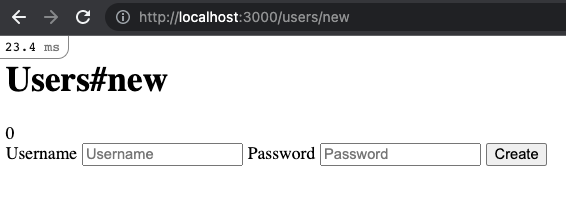

Fill out the form for "test_user" and some password, and click Create. User will be created. Browser submits POST to `/users` endpoint which gets mapped to `create` action in Users controller.

Network tab from browser:

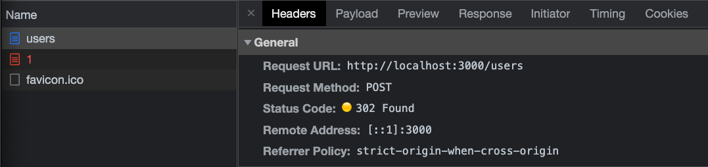

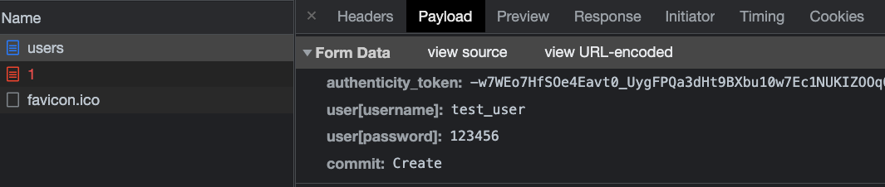

After user creation will get error about Show action not defined because the user controller `create` method is attempting to redirect to the show view with this line. Redirect means a new http request so it will go back through the controller, expecting to find a `show` method:

```ruby
redirect_to @user, alert: "User created successfully."
```

Rails server output. Notice `bcrypt` has taken plain-text password from form, and saved it in `password_digest` field in `users` table as hashed value "$2a$12$kF40GpcaLKt3zhn95PHkheKzAhZj9G/jD4odJ8rl8fAzDAcJ/Y1rq". We didn't have to write this code.

Then notice it's attempting redirect to GET "/users/1".

```
Started POST "/users" for ::1 at 2022-07-03 09:44:31 -0400
Processing by UsersController#create as HTML
  Parameters: {"authenticity_token"=>"[FILTERED]", "user"=>{"username"=>"test_user", "password"=>"[FILTERED]"}, "commit"=>"Create"}
  TRANSACTION (0.1ms)  begin transaction
  ↳ app/controllers/users_controller.rb:12:in `create'
  User Create (3.1ms)  INSERT INTO "users" ("username", "password_digest", "created_at", "updated_at") VALUES (?, ?, ?, ?)  [["username", "test_user"], ["password_digest", "$2a$12$kF40GpcaLKt3zhn95PHkheKzAhZj9G/jD4odJ8rl8fAzDAcJ/Y1rq"], ["created_at", "2022-07-03 13:44:31.437865"], ["updated_at", "2022-07-03 13:44:31.437865"]]
  ↳ app/controllers/users_controller.rb:12:in `create'
  TRANSACTION (1.4ms)  commit transaction
  ↳ app/controllers/users_controller.rb:12:in `create'
Redirected to http://localhost:3000/users/1
Completed 302 Found in 330ms (ActiveRecord: 4.6ms | Allocations: 2673)


Started GET "/users/1" for ::1 at 2022-07-03 09:44:31 -0400

AbstractController::ActionNotFound (The action 'show' could not be found for UsersController
...
```

Browser error for show view:

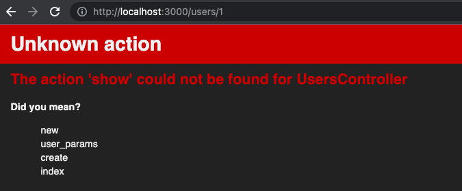

To fix error, need to define `show` method in users controller. Make use of `params[:id]`, which will contain for example `1` given a url of `/users/1`:

```ruby
# news/app/controllers/users_controller.rb
def show
  @user = User.find(params[:id])
end
```

And also need a corresponding show view, using [time_ago_in_words](https://apidock.com/rails/ActionView/Helpers/DateHelper/time_ago_in_words) view helper to convert created_at into human readable version:

```erb
<!-- news/app/views/users/show.html.erb -->
<h1>Show</h1>
<p><%= @user.username %></p>
<p>Created <%= time_ago_in_words(@user.created_at) %> ago.</p>
```

Refresh show view `http://localhost:3000/users/1` should now render in browser:

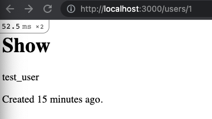

#### Build Login Page

Define login route:

```ruby
Rails.application.routes.draw do
  resources :users

  # new login route defined here
  get 'home/login'

  get 'home/index'
  root 'home#index'
end
```

Add `login` method to home controller (will come back to fill in implementation later):

```ruby
# news/app/controllers/home_controller.rb
class HomeController < ApplicationController
  def index
  end

  def login
  end
end
```

Add login view with simple form:

```erb
<!-- news/app/views/home/login.html.erb -->
<h1>Login</h1>
<form action="/home/login" method="POST">
  <input type="text" name="username" placeholder="username">
  <input type="password" name="password" placeholder="password">
  <button type="submit">Login</button>
</form>
```

Try to login by navigating to `http://localhost:3000/home/login`, filling out the form with `test_user` created earlier, and clicking "Login" button to submit the form:

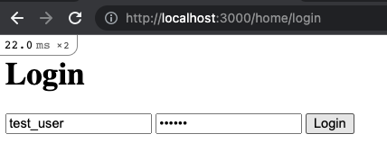

When clicking the submit button, browser attempts to POST to "/home/login" route but will get a 404 error because we haven't defined this route yet (only defined `get` in router).

Rails server output:

```
Started POST "/home/login" for ::1 at 2022-07-03 10:26:31 -0400

ActionController::RoutingError (No route matches [POST] "/home/login"):
```

Browser displays error:

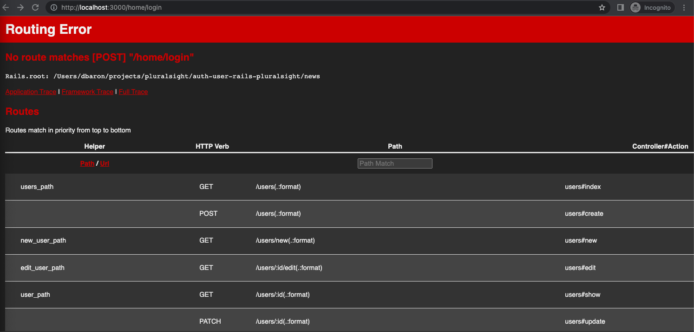

Fix this by adding a post entry for login in the router:

```ruby
# news/config/routes.rb
Rails.application.routes.draw do
  resources :users

  get 'home/login'
  post 'home/login'

  get 'home/index'
  root 'home#index'
end
```

Try to login/submit the form again (can simply refresh `http://localhost:3000/home/login` since we're already in the middle of POST):

This time get an error about authenticity token. Rails server output:

```
Started POST "/home/login" for ::1 at 2022-07-03 10:29:53 -0400
Processing by HomeController#login as HTML
  Parameters: {"username"=>"test_user", "password"=>"[FILTERED]"}
Can't verify CSRF token authenticity.
Completed 422 Unprocessable Entity in 0ms (Allocations: 430)


ActionController::InvalidAuthenticityToken (ActionController::InvalidAuthenticityToken):

actionpack (6.1.6) lib/action_controller/metal/request_forgery_protection.rb:211:in `handle_unverified_request'
...
```

Browser shows:

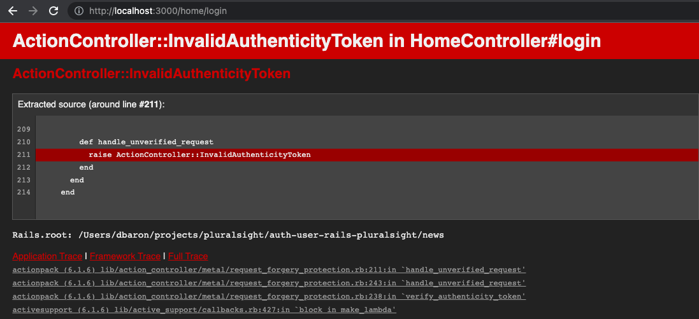

To fix this, add `authenticity_token` as a hidden field in login form. Note use of [hidden_field_tag](https://apidock.com/rails/ActionView/Helpers/FormTagHelper/hidden_field_tag) view helper to generate a hidden html input field:

```erb
<!-- news/app/views/home/login.html.erb -->
<h1>Login</h1>
<form action="/home/login" method="POST">
  <%= hidden_field_tag :authenticity_token, form_authenticity_token %>
  <input type="text" name="username" placeholder="username">
  <input type="password" name="password" placeholder="password">
  <button type="submit">Login</button>
</form>
```

Refresh get view in browser `http://localhost:3000/home/login`, dev tools shows hidden field:

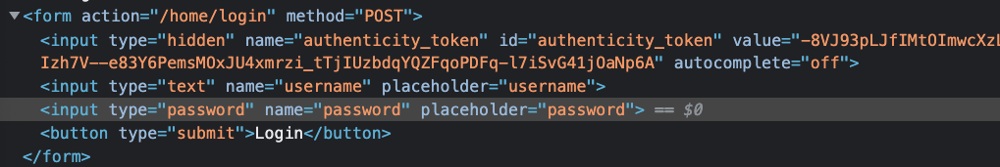

Try to submit login form again, this time it "works", but remember controller login method does nothing for now, so the default is to render the same view again. Rails server output:

```
Started POST "/home/login" for ::1 at 2022-07-03 10:37:11 -0400
Processing by HomeController#login as HTML
  Parameters: {"authenticity_token"=>"[FILTERED]", "username"=>"test_user", "password"=>"[FILTERED]"}
  Rendering layout layouts/application.html.erb
  Rendering home/login.html.erb within layouts/application
  Rendered home/login.html.erb within layouts/application (Duration: 0.3ms | Allocations: 119)
[Webpacker] Everything's up-to-date. Nothing to do
  Rendered layout layouts/application.html.erb (Duration: 9.3ms | Allocations: 3773)
Completed 200 OK in 10ms (Views: 9.8ms | Allocations: 4188)
```

To implement home controller `login` method, it's first useful to see what parameters are available.

Start by simply setting instance var `@params` in controller:

```ruby
# news/app/controllers/home_controller.rb
class HomeController < ApplicationController
  def index
  end

  def login
    @params = params
  end
end
```

Add some temp debug to the login view:

```erb
<h1>Login</h1>
<form action="/home/login" method="POST">
  <%= hidden_field_tag :authenticity_token, form_authenticity_token %>
  <input type="text" name="username" placeholder="username">
  <input type="password" name="password" placeholder="password">
  <button type="submit">Login</button>
</form>

<%= debug(params) %>
```

When first visiting `GET http://localhost:3000/home/login`, params simply contain controller and action:

```
--- !ruby/object:ActionController::Parameters
parameters: !ruby/hash:ActiveSupport::HashWithIndifferentAccess
  controller: home
  action: login
permitted: false
```

But after submitting the form (recall since no controller code has been implemented yet, default action is to render the same view, which maintains the instance vars). Now we can see the params contain the usename and password from the form fields:

```
--- !ruby/object:ActionController::Parameters
parameters: !ruby/hash:ActiveSupport::HashWithIndifferentAccess
  authenticity_token: 42HkhdmbqDquljh1d_uYSXNN6XJORzGcu2CGO9RDBjhMR7TZbf9ghpA2F-TcX20hn0bkejQZOATJ9YQihuxUwg
  username: test_user
  password: abc123
  controller: home
  action: login
permitted: false
```

Now that we know what params are available, we can implement the login logic in home controller. This isn't the final version, for now, simply find the user by the username given in params, and set it as an instance variable:

```ruby
# news/app/controllers/home_controller.rb
class HomeController < ApplicationController
  def index
  end

  def login
    if params["username"]
      user = User.find_by(username: params[:username])
      @user = user
    end
  end
end
```

Add debug in the login view to output the `@user` instance variable set by controller:

```erb
<h1>Login</h1>
<form action="/home/login" method="POST">
  <%= hidden_field_tag :authenticity_token, form_authenticity_token %>
  <input type="text" name="username" placeholder="username">
  <input type="password" name="password" placeholder="password">
  <button type="submit">Login</button>
</form>

<h2>Debug params</h2>
<%= debug(params) %>

<h2>Debug user</h2>
<%= debug(@user) %>
```

Then navigate to `http://localhost:3000/home/login` and login:

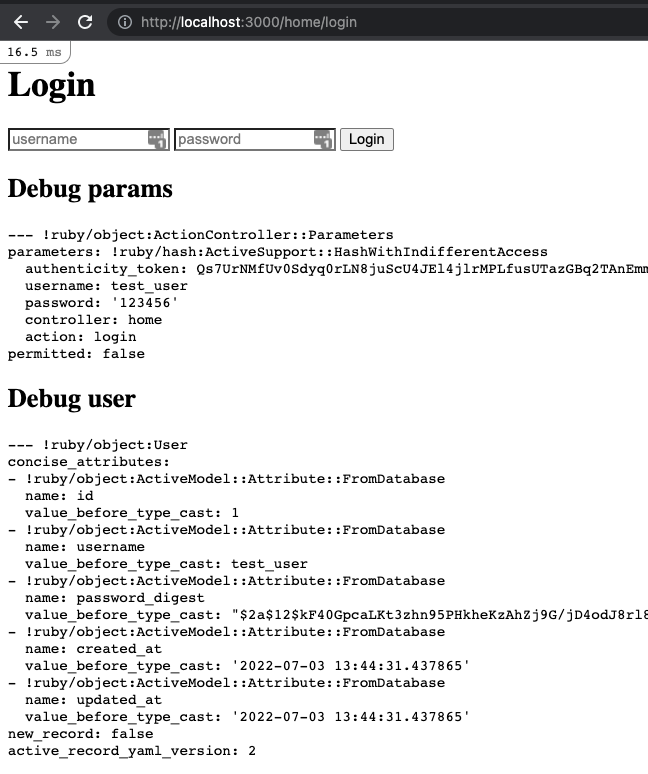

Finally, need to authenticate user. Call `authenticate` method on user instance, passing in the password from params.

```ruby
class HomeController < ApplicationController
  def index
  end

  def login
    if params["username"]
      user = User.find_by(username: params[:username])
      @valid = user.authenticate(params[:password])
      puts("=== LOGIN @valid = #{@valid}")
    end
  end
end
```

Note that `authenticate` is a method added by Rails ActiveModel. If the given password is correct, will return a user model instance, otherwise, returns boolean false.

Can find information about a method in rails console `bin/rails c`:

```ruby
user = User.find_by(username: "test_user")

user.method(:authenticate).inspect
# => "#<Method: User(id: integer, username: string, password_digest: string, created_at: datetime, updated_at: datetime)(#<ActiveModel::SecurePassword::InstanceMethodsOnActivation:0x00007f7e040f67f0>)#authenticate(authenticate_password)(unencrypted_password) /Users/dbaron/.rbenv/versions/2.7.2/lib/ruby/gems/2.7.0/gems/activemodel-6.1.6/lib/active_model/secure_password.rb:120>"

user.method(:authenticate).owner
# => #<ActiveModel::SecurePassword::InstanceMethodsOnActivation:0x00007f7e040f67f0>
```

See Ruby docs for [Method](https://docs.ruby-lang.org/en/2.7.0/Method.html#method-i-inspect).

See Rails source (couldn't find docs) for [authenticate](https://github.com/rails/rails/blob/3872bc0e54d32e8bf3a6299b0bfe173d94b072fc/activemodel/lib/active_model/secure_password.rb#L92). Note that `authenticate` method is an alias for `authenticate_password` given that the model instance has a `password` attribute.

Now go back to home/login view, fill out login form with incorrect password for `test_user` and check Rails server output. Note that valid is false:

```
Started POST "/home/login" for ::1 at 2022-07-09 07:40:36 -0400
Processing by HomeController#login as HTML
  Parameters: {"authenticity_token"=>"[FILTERED]", "username"=>"test_user", "password"=>"[FILTERED]"}
  User Load (0.1ms)  SELECT "users".* FROM "users" WHERE "users"."username" = ? LIMIT ?  [["username", "test_user"], ["LIMIT", 1]]
  ↳ app/controllers/home_controller.rb:7:in `login'
=== LOGIN @valid = false
  Rendering layout layouts/application.html.erb
  Rendering home/login.html.erb within layouts/application
  Rendered home/login.html.erb within layouts/application (Duration: 0.4ms | Allocations: 119)
[Webpacker] Everything's up-to-date. Nothing to do
  Rendered layout layouts/application.html.erb (Duration: 15.6ms | Allocations: 3773)
Completed 200 OK in 367ms (Views: 48.7ms | ActiveRecord: 0.1ms | Allocations: 4746)
```

Try again with correct password for `test_user`, this time its the user model instance:

```
Started POST "/home/login" for ::1 at 2022-07-09 07:42:35 -0400
Processing by HomeController#login as HTML
  Parameters: {"authenticity_token"=>"[FILTERED]", "username"=>"test_user", "password"=>"[FILTERED]"}
  User Load (0.1ms)  SELECT "users".* FROM "users" WHERE "users"."username" = ? LIMIT ?  [["username", "test_user"], ["LIMIT", 1]]
  ↳ app/controllers/home_controller.rb:7:in `login'
=== LOGIN @valid = #<User:0x00007f7d659c8e18>
  Rendering layout layouts/application.html.erb
  Rendering home/login.html.erb within layouts/application
  Rendered home/login.html.erb within layouts/application (Duration: 0.6ms | Allocations: 119)
[Webpacker] Everything's up-to-date. Nothing to do
  Rendered layout layouts/application.html.erb (Duration: 8.3ms | Allocations: 3773)
Completed 200 OK in 318ms (Views: 8.9ms | ActiveRecord: 0.1ms | Allocations: 4747)
```

### Password Recovery

Need to setup app to send email. This is controlled by `config.action_mailer.XXX` settings in `news/config/environments/development.rb`. Instructor put in values for a gmail account but didn't explain what this is - probably want to use env vars rather than hard-coded password.

Also need to set host url so that can generate absolute urls in email (will do this later).

```ruby
# news/config/environments/development.rb

# https://discuss.rubyonrails.org/t/define-host-so-absolute-urls-work-in-development-and-test/75085
config.action_mailer.default_url_options = { host: 'localhost:3000' } # for absolute urls in email
config.action_mailer.asset_host = "http://localhost:3000" # for image URLs in HTML email

# for development ignore send errors, just need to see generated email in server output
config.action_mailer.raise_delivery_errors = false
config.action_mailer.perform_caching = false

# example SMTP but will need SendGrid or some other service to actually work
# credentials should be env vars
config.action_mailer.smtp_settings = {
  address: 'smtp.gmail.com',
  port: 587,
  user_name: 'example',
  password: 'example',
  authentication: 'plain',
  enable_starttls_auto: true
}
```

Docs on [using gmail with Action Mailer](https://guides.rubyonrails.org/action_mailer_basics.html#action-mailer-configuration-for-gmail), but need to change personal gmail settings to allow it and need to setup app password which is no longer recommended for security?

Maybe try free tier of [SendGrid](https://signup.sendgrid.com/) and [configure it](https://docs.sendgrid.com/for-developers/sending-email/rubyonrails).

Update user table/model to have email and reset token fields:

```
bin/rails generate migration AddResetsToUser
```

```ruby
# news/db/migrate/20220709121116_add_resets_to_user.rb
class AddResetsToUser < ActiveRecord::Migration[6.1]
  def change
    change_table :users do |t|
      t.string :email
      t.string :reset
    end
  end
end
```

`reset` token will be emailed to user to verify person requesting a password reset is the same as person that received the email.

Run migration with `bin/rails db:migrate`.

Use Rails console `bin/rails c` to add email to the test user:

```ruby
user = User.find_by(username: "test_user")
user.update(email: "exampleemail@gmail.com")
```

Generate a password controller to handle `reset` and `forgot` actions. This will also add router entries to expose GET urls for password/reset and password/forgot, and also generate views:

```
bin/rails generate controller password reset forgot
```

Output:

```
create  app/controllers/password_controller.rb
 route  get 'password/reset'
        get 'password/forgot'
invoke  erb
create    app/views/password
create    app/views/password/reset.html.erb
create    app/views/password/forgot.html.erb
invoke  test_unit
create    test/controllers/password_controller_test.rb
invoke  helper
create    app/helpers/password_helper.rb
invoke    test_unit
invoke  assets
invoke    scss
create      app/assets/stylesheets/password.scss
```

Also generate email templates with:

```
bin/rails generate mailer ResetMailer
```

Output:

```
create  app/mailers/reset_mailer.rb
invoke  erb
create    app/views/reset_mailer
invoke  test_unit
create    test/mailers/reset_mailer_test.rb
create    test/mailers/previews/reset_mailer_preview.rb
```

Implement forgot password view. This needs to prompt user for their email. If a user exists with this email address, the controller needs to generate a token for this user and email it to them.

```erb
<!-- news/app/views/password/forgot.html.erb -->
<h1>Forgot Password Form</h1>

<form action="/password/forgot" method="POST">
  <%= hidden_field_tag :authenticity_token, form_authenticity_token %>
  <input type="text" name="email" placeholder="email">
  <button type="submit">Submit</button>
</form>
```

Try this out by navigating to `http://localhost:3000/password/forgot`:

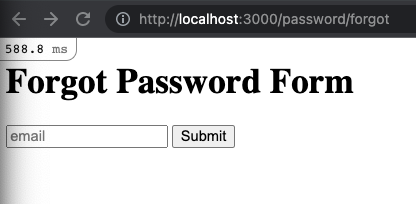

However, in order to submit form, need to add `post` methods to router. Note that both `get` and `post` will be mapped to the same password controller actions. The difference will be that GET won't have any parameters because a form isn't being submitted, whereas POST will have parameters from form submission. We'll be checking for this in the action method:

```ruby
# news/config/routes.rb
Rails.application.routes.draw do
  get 'password/reset'
  post 'password/reset'
  get 'password/forgot'
  post 'password/forgot'

  resources :users

  get 'home/login'
  post 'home/login'

  get 'home/index'
  root 'home#index'
end
```

Then implement controller `forgot` action. Check if `email` param exists. Best practice would be if email not found, simply render the same page with an error, but for this app, will raise a not found exception. If user is found, generate a token, save it to user's `reset` field, and render the token back in plain text for now (will be replaced by email sending later).

Note use of rendering plain text to browser is explained in [Rails Guide Layout and Rendering](https://guides.rubyonrails.org/layouts_and_rendering.html#rendering-text).

Also useful to read [options for render method](https://guides.rubyonrails.org/layouts_and_rendering.html#options-for-render).

A real implementation would encrypt token before saving in db???

```ruby
class PasswordController < ApplicationController
  def reset
  end

  def forgot
    if params[:email]
      user = User.find_by(email: params[:email]) or not_found
      token = SecureRandom.hex(10)
      user.reset = token
      user.save

      render plain: user.reset
    end
  end

  def not_found
    raise ActionController::RoutingError.new('Not Found')
  end
end
```

Try it out: Navigate to `http://localhost:3000/password/forgot`, enter email saved to test_user earlier `exampleemail@gmail.com` and submit form.

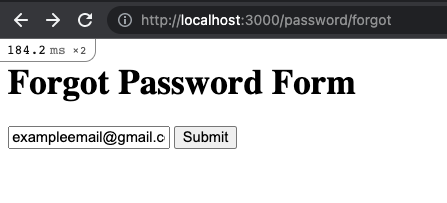

Rails server output shows:

```
Started POST "/password/forgot" for ::1 at 2022-07-10 08:35:35 -0400
Processing by PasswordController#forgot as HTML
  Parameters: {"authenticity_token"=>"[FILTERED]", "email"=>"exampleemail@gmail.com"}
  User Load (0.1ms)  SELECT "users".* FROM "users" WHERE "users"."email" = ? LIMIT ?  [["email", "exampleemail@gmail.com"], ["LIMIT", 1]]
  ↳ app/controllers/password_controller.rb:7:in `forgot'
  TRANSACTION (0.1ms)  begin transaction
  ↳ app/controllers/password_controller.rb:10:in `forgot'
  User Update (3.8ms)  UPDATE "users" SET "updated_at" = ?, "reset" = ? WHERE "users"."id" = ?  [["updated_at", "2022-07-10 12:35:35.762773"], ["reset", "df549da1538d34ec8e83"], ["id", 1]]
  ↳ app/controllers/password_controller.rb:10:in `forgot'
  TRANSACTION (1.0ms)  commit transaction
  ↳ app/controllers/password_controller.rb:10:in `forgot'
  Rendering text template
  Rendered text template (Duration: 0.1ms | Allocations: 26)
Completed 200 OK in 148ms (Views: 21.8ms | ActiveRecord: 5.2ms | Allocations: 9883)
```

And browser displays plain text token:

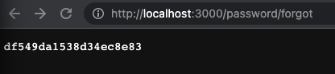

Now implement `reset` action. Use `query_parameters` to extract token from url such as `http://localhost:3000/password/reset?token=dcd7160251b020d8403b`. Render a "not found" page if token not provided. Then lookup the user who has their `reset` field saved as this token. For now, just render the username back in plain text.

Note that `params` can also be used to access the token from url. See [Rails Guides parameters](https://guides.rubyonrails.org/action_controller_overview.html#path-parameters-query-parameters-and-request-parameters) for explanation:

> Rails collects all of the parameters sent along with the request in the params hash, whether they are sent as part of the query string, or the post body. The request object has three accessors that give you access to these parameters depending on where they came from. The query_parameters hash contains parameters that were sent as part of the query string while the request_parameters hash contains parameters sent as part of the post body. The path_parameters hash contains parameters that were recognized by the routing as being part of the path leading to this particular controller and action.

```ruby
# news/app/controllers/password_controller.rb
class PasswordController < ApplicationController
  def reset
    # instructor used query_parameters but params works just as well didn't explain why one over the other
    token = request.query_parameters[:token] or not_found
    # token = request.params[:token]

    # find the user who has this token saved in their `reset` field:
    user = User.find_by(reset: token) or not_found
    render plain: user.username
  end

  def forgot
    if params[:email]
      user = User.find_by(email: params[:email]) or not_found
      token = SecureRandom.hex(10)
      user.reset = token
      user.save

      render plain: user.reset
    end
  end

  def not_found
    raise ActionController::RoutingError.new('Not Found')
  end
end
```

To try this, first use Rails console `bin/rails c` to get the users token that we saved earlier:

```ruby
user = User.find_by(username: "test_user")
#   User Load (0.3ms)  SELECT "users".* FROM "users" WHERE "users"."username" = ? LIMIT ?  [["username", "test_user"], ["LIMIT", 1]]
# => #<User id: 1, username: "test_user", password_digest: [FILTERED], created_at: "2022-07-03 13:44:31.437865000 +0000", updated_at: "2022-07-10 12:35:35.762773000 +0000", email: "ex...

user.reset
# => "df549da1538d34ec8e83"
```

Then navigate to the password reset page, passing in this token as a query parameter `http://localhost:3000/password/reset?token=df549da1538d34ec8e83`. Browser will display back in plain text the username: `test_user`.

Now implement the reset password form. Note the hidden field for reset token to ensure users can't spoof reset password requests.

```erb
<!-- news/app/views/password/reset.html.erb -->
<h1>Reset Password for <%= @user.username %></h1>

<form action="/password/reset" method="POST">
  <%= hidden_field_tag :authenticity_token, form_authenticity_token %>
  <%= hidden_field_tag "token", @user.reset %>
  <input type="password" name="password" placeholder="New Password">
  <button type="submit">Submit</button>
</form>
```

Now go back and update `reset` method in password controller. So far it's only handling the `get` request. Update it to also check for presence of `password` param, and if present, update the users password and remove the token. Render plain text success message as response.

Note I had to change `or` to `||` for first line otherwise it immediately fails when posting form because `request.query_parameters[:token]` will be nil.

```ruby
# news/app/controllers/password_controller.rb
class PasswordController < ApplicationController
  def reset
    token = request.query_parameters[:token] || params[:token] || not_found
    @user = User.find_by(reset: token) or not_found
    if params[:password]
      @user.password = params[:password]
      @user.reset = nil
      @user.save
      render plain: "Successfully reset password."
    end
  end

  def forgot
    if params[:email]
      user = User.find_by(email: params[:email]) or not_found
      token = SecureRandom.hex(10)
      user.reset = token
      user.save

      render plain: user.reset
    end
  end

  def not_found
    raise ActionController::RoutingError.new('Not Found')
  end
end
```

Try it out: Navigate to reset password view passing in token for test_user: `http://localhost:3000/password/reset?token=df549da1538d34ec8e83`:

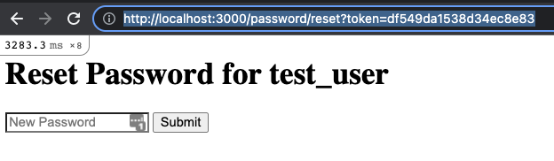

Provide a new password and submit form. Rails server output:

```
Started POST "/password/reset" for ::1 at 2022-07-10 09:38:39 -0400
Processing by PasswordController#reset as HTML
  Parameters: {"authenticity_token"=>"[FILTERED]", "token"=>"[FILTERED]", "password"=>"[FILTERED]"}
  User Load (0.2ms)  SELECT "users".* FROM "users" WHERE "users"."reset" = ? LIMIT ?  [["reset", "df549da1538d34ec8e83"], ["LIMIT", 1]]
  ↳ app/controllers/password_controller.rb:6:in `reset'
  TRANSACTION (0.1ms)  begin transaction
  ↳ app/controllers/password_controller.rb:12:in `reset'
  User Update (0.5ms)  UPDATE "users" SET "password_digest" = ?, "updated_at" = ?, "reset" = ? WHERE "users"."id" = ?  [["password_digest", "$2a$12$sLRK9PXXoCXzvKSrmsBem.um0X2nVeq5oxQ328Og7Ni8TSWIaf5pO"], ["updated_at", "2022-07-10 13:38:39.479365"], ["reset", nil], ["id", 1]]
  ↳ app/controllers/password_controller.rb:12:in `reset'
  TRANSACTION (1.3ms)  commit transaction
  ↳ app/controllers/password_controller.rb:12:in `reset'
  Rendering text template
  Rendered text template (Duration: 0.1ms | Allocations: 25)
Completed 200 OK in 306ms (Views: 0.5ms | ActiveRecord: 2.1ms | Allocations: 3018)
```

Browser response:

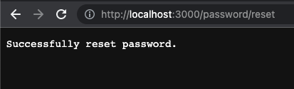

Update `forgot` action of password controller to *NOT* return the token in plain text response (that was just for demonstration, otherwise any user could reset any other users password). Instead, return a response saying something like "password reset link has been emailed to you".

```ruby
# news/app/controllers/password_controller.rb
class PasswordController < ApplicationController
  def reset
    token = request.query_parameters[:token] || params[:token] || not_found
    @user = User.find_by(reset: token) or not_found
    if params[:password]
      @user.password = params[:password]
      @user.reset = nil
      @user.save
      render plain: "Successfully reset password."
    end
  end

  def forgot
    if params[:email]
      user = User.find_by(email: params[:email]) or not_found
      token = SecureRandom.hex(10)
      user.reset = token
      user.save
      render plain: "A link to reset your password has been sent to that email if it exists. "
    end
  end

  def not_found
    raise ActionController::RoutingError.new('Not Found')
  end
end
```

Finally, we need to actually email the token to user.

Define data to be included in email in `ResetMailer`. We need the user's email address, and need to construct the reset password url, which consists of the route and token parameter:

```ruby
# news/app/mailers/reset_mailer.rb
class ResetMailer < ApplicationMailer
  def reset_password
    @user = params[:user]
    @url = "#{password_reset_url}?token=#{params[:token]}"
    mail(to: @user.email, subject: 'Reset Password for News App')
  end
end
```

Next define the email template, which will have access to the instance variables set in `ResetMailer`. Can use the same templating syntax as in any Rails view:

```erb
<!-- news/app/views/reset_mailer/reset_password.html.erb -->
<h1>Reset your password for News App</h1>
<p>
  Hi <%= @user.username %>, your password has been requested to be reset.
  Reset it by clicking <a href="<%= @url %>">here</a>.
</p>
```

To send the email, update `forgot` method of `PasswordController` to invoke `ResetMailer`:

```ruby
# news/app/controllers/password_controller.rb
class PasswordController < ApplicationController
  def reset
    token = request.query_parameters[:token] || params[:token] || not_found
    @user = User.find_by(reset: token) or not_found
    if params[:password]
      @user.password = params[:password]
      @user.reset = nil
      @user.save
      render plain: "Successfully reset password."
    end
  end

  def forgot
    if params[:email]
      # Update user with a reset token
      user = User.find_by(email: params[:email]) or not_found
      token = SecureRandom.hex(10)
      user.reset = token
      user.save

      # Email token to user
      ResetMailer.with(user: user, token: token).reset_password.deliver_now

      # A simple response to browser
      render plain: "A link to reset your password has been sent to that email if it exists. "
    end
  end

  def not_found
    raise ActionController::RoutingError.new('Not Found')
  end
end
```

Rails API for [ActionMailer::Base](https://api.rubyonrails.org/classes/ActionMailer/Base.html).

Let's try it out, navigate to `http://localhost:3000/password/forgot` and fill in email field with our example user created earlier `exampleemail@gmail.com`:

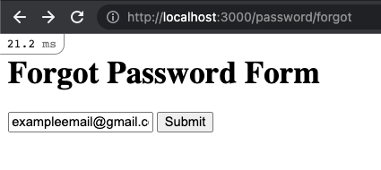

Clicking Submit will run the `forgot` method in `PasswordController`. Email sending will fail because of invalid smtp credentials configured earlier, but Rails server output will show the generated html email:

```
Started POST "/password/forgot" for ::1 at 2022-07-16 08:36:45 -0400
Processing by PasswordController#forgot as HTML
  Parameters: {"authenticity_token"=>"[FILTERED]", "email"=>"exampleemail@gmail.com"}
  User Load (6.0ms)  SELECT "users".* FROM "users" WHERE "users"."email" = ? LIMIT ?  [["email", "exampleemail@gmail.com"], ["LIMIT", 1]]
  ↳ app/controllers/password_controller.rb:16:in `forgot'
  TRANSACTION (0.1ms)  begin transaction
  ↳ app/controllers/password_controller.rb:19:in `forgot'
  User Update (1.8ms)  UPDATE "users" SET "updated_at" = ?, "reset" = ? WHERE "users"."id" = ?  [["updated_at", "2022-07-16 12:36:46.030071"], ["reset", "83f0fba53b4a01ddb806"], ["id", 1]]
  ↳ app/controllers/password_controller.rb:19:in `forgot'
  TRANSACTION (1.8ms)  commit transaction
  ↳ app/controllers/password_controller.rb:19:in `forgot'
  Rendering layout layouts/mailer.html.erb
  Rendering reset_mailer/reset_password.html.erb within layouts/mailer
  Rendered reset_mailer/reset_password.html.erb within layouts/mailer (Duration: 1.2ms | Allocations: 149)
  Rendered layout layouts/mailer.html.erb (Duration: 2.2ms | Allocations: 319)
ResetMailer#reset_password: processed outbound mail in 12.5ms
Delivered mail 62d2b0de1d381_4e3a39946385c@some-machine.local.mail (348.0ms)
Date: Sat, 16 Jul 2022 08:36:46 -0400
From: from@example.com
To: exampleemail@gmail.com
Message-ID: <62d2b0de1d381_4e3a39946385c@some-machine.local.mail>
Subject: Reset Password for News App
Mime-Version: 1.0
Content-Type: text/html;
 charset=UTF-8
Content-Transfer-Encoding: 7bit

<!DOCTYPE html>
<html>
  <head>
    <meta http-equiv="Content-Type" content="text/html; charset=utf-8" />
    <style>
      /* Email styles need to be inline */
    </style>
  </head>

  <body>
    <h1>Reset your password for News App</h1>
<p>
  Hi test_user, your password has been requested to be reset.
  Reset it by clicking <a href="http://localhost:3000/password/reset?token=83f0fba53b4a01ddb806">here</a>.
</p>
  </body>
</html>

  Rendering text template
  Rendered text template (Duration: 0.1ms | Allocations: 25)
Completed 200 OK in 536ms (Views: 2.9ms | ActiveRecord: 10.6ms | Allocations: 24722)
```

Try the reset link by copying it from Rails server output and paste it in browser url `http://localhost:3000/password/reset?token=83f0fba53b4a01ddb806`:

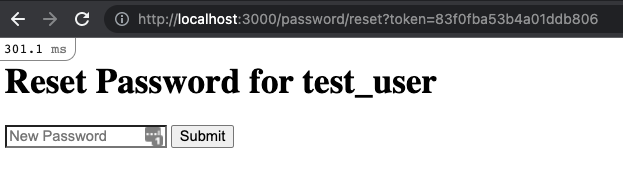

## Keeping Users Signed in with Secure Session Management

Need to make app "remember" the user login between pages.

**Session:** Secure storage on backend of webapp to keep track of each user's information.

Need to correlate each session on website to a user in the database.

Firstly, make `username` and `email` fields on `User` model unique. Not strictly required for sessions but is good practice:

```ruby
# news/app/models/user.rb
class User < ApplicationRecord
  has_secure_password
  validates :username, :email, uniqueness: true
end
```

Now use Rails built-in feature to setup sessions.

Any code added to `ApplicationController` will be inherited by all other controllers. When app was initially scaffolded, it's an empty class:

```ruby
# news/app/controllers/application_controller.rb
class ApplicationController < ActionController::Base
end
```

Since all other controllers inherit from it, this is the best place to implement authentication and session management:

```ruby
class ApplicationController < ActionController::Base
  protect_from_forgery with: :exception

  before_action :authorized
  helper_method :current_user
  helper_method :logged_in?

  # Access current user from session at any time
  def current_user
    User.find_by(id: session[:user_id])
  end

  # Determine if user is logged in
  def logged_in?
    !current_user.nil?
  end

  # Force an unauthenticated user to login
  def authorized
    redirect_to '/home/login' unless logged_in?
  end
end
```

Rails API for controller [helper_method](https://api.rubyonrails.org/classes/AbstractController/Helpers/ClassMethods.html#method-i-helper_method):

> Declare a controller method as a helper. For example, the following makes the current_user and logged_in? controller methods available to the view.

Rails API for controller [before_action](https://api.rubyonrails.org/classes/AbstractController/Callbacks/ClassMethods.html#method-i-before_action):

> Append a callback before actions. See _insert_callbacks for parameter details. If the callback renders or redirects, the action will not run. If there are additional callbacks scheduled to run after that callback, they are also cancelled.

`current_user` methods finds user in database for `user_id` stored in session. If no such user can be found, assume user has logged out.

Update HomeController `login` method to save the logged in user_id in the session, if the user's password was valid:

```ruby
# news/app/controllers/home_controller.rb
class HomeController < ApplicationController
  def index
  end

  def login
    if params["username"]
      user = User.find_by(username: params[:username])
      @valid = user.authenticate(params[:password])
      if @valid
        session[:user_id] = user.id
      end
    end
  end
end
```

Try to view homepage at `http://localhost:3000`, but there's an error due to infinite redirect loop:

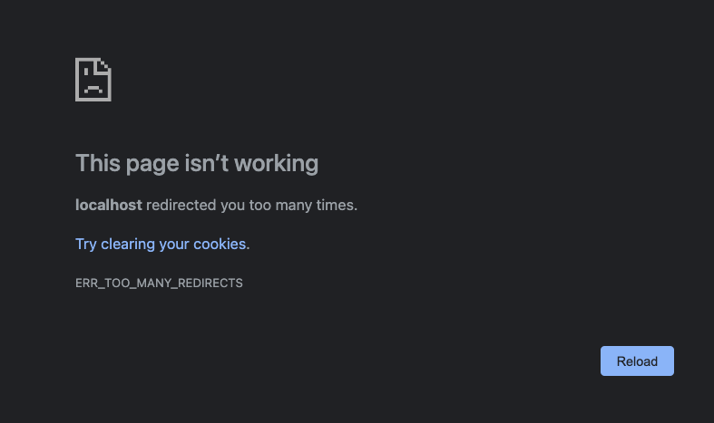

Issue is Application controller is redirecting to `/home/login` if user not logged in, BUT its in a `before_action` callback which will run for *every* controller including the HomeController, so that also redirects, creating infinite loop.

To fix this, need to specify an exception for HomeController to skip the `before_action` callback that's specified in the ApplicationController:

```ruby
# news/app/controllers/home_controller.rb
class HomeController < ApplicationController
  skip_before_action :authorized

  def index
  end

  def login
    if params["username"]
      user = User.find_by(username: params[:username])
      @valid = user.authenticate(params[:password])
      if @valid
        session[:user_id] = user.id
      end
    end
  end
end
```

Try to view login page now `http://localhost:3000/home/login`, this time should display login form, and `http://localhost:3000` should display homepage with list of news articles. This is because both `login` and `index` are part of HomeController, which is no longer executing `authorized` method from ApplicationController due to exception: `skip_before_action :authorized`.

Create a test user in console:

```ruby
u = User.create!(username: "test1", email: "test1@test.com", password: "abc123")
```

Fill in login form with valid values, submit. Check browser dev tools -> Application. Will show cookie `_news_session`.

Right now the UI is responding with `/home/login` view because we haven't defined any other behaviour, we can debug view the session id here:

```erb
<!-- news/app/views/home/login.html.erb -->
<h1>Login</h1>
<form action="/home/login" method="POST">
  <%= hidden_field_tag :authenticity_token, form_authenticity_token %>
  <input type="text" name="username" placeholder="username">
  <input type="password" name="password" placeholder="password">
  <button type="submit">Login</button>
</form>

<%= debug(session[:user_id]) %>
```

After successful login:

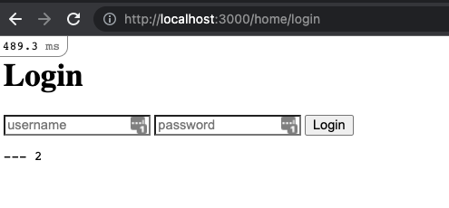

Define `logout` method in HomeController - simple implementation, remove `user_id` from `session`:

```ruby
# news/app/controllers/home_controller.rb
class HomeController < ApplicationController
  # ...
  def logout
    session[:user_id] = nil
  end
end
```

Create corresponding logout view that simply displays a success message:

```erb
<!-- news/app/views/home/logout.html.erb -->
<h1>Successfully logged out!</h1>
```

Ad route for logout:

```ruby
Rails.application.routes.draw do
  # ...
  get 'home/logout'
  # ...
end
```

Try this out by navigating to `http://localhost:3000/home/logout`:

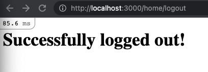

But to confirm user is really logged out, we should update some views to show the logged in user information, then if its no longer displayed, user can know they're really logged out.

First thing to do is make sure HomeController `index` method will indeed enforce authentication, so only logged in users can view the news listing. Use `only` parameter of `skip_before_action` method to specify only `login` and `logout` methods will bypass auth:

```ruby
# news/app/controllers/home_controller.rb
class HomeController < ApplicationController
  skip_before_action :authorized, only: [:login, :logout]

  def index
  end

  def login
    if params["username"]
      user = User.find_by(username: params[:username])
      @valid = user.authenticate(params[:password])
      if @valid
        puts("=== authentication successful for #{user.username}, populating session with #{user.id}")
        session[:user_id] = user.id
      else
        puts("=== authentication failed for #{user.username}")
      end
    end
  end

  def logout
    session[:user_id] = nil
  end
end
```

Now try to access homepage at `http://localhost:3000` and it redirects to login page `http://localhost:3000/home/login` because we've just logged out.

Then submit a successful login and try to view homepage again, this time news cards are displayed.

Next feature: Let everyone view article listing, BUT only display article details if user is logged in. To do this, add `index` method to list of exceptions in `skip_before_action` of HomeController:

```ruby
# news/app/controllers/home_controller.rb
class HomeController < ApplicationController
  skip_before_action :authorized, only: [:login, :logout, :index]
  # ...
end
```

Then modify home view that lists all the articles. Add a condition in the expression that displays article `description` to use the `logged_in?` helper method defined in ApplicationController. Notice had to add parens `(...)` around positive result of ternary, otherwise get template syntax error:

```erb
<div class="articles">
  <h1>Articles</h1>
  <% articles('Google').items.each do |item| %>
    <div class="article">
      <h2><%= item.title %></h2>
      <p><%= logged_in? ? (raw item.description) : "You must be logged in to view this." %></p>
      <p><%= item.pubDate %></p>
    </div>
  <% end %>
</div>
```

Logout by visiting `http://localhost:3000/home/logout`, and then visit homepage at `http://localhost:3000`, now the cards look like this:

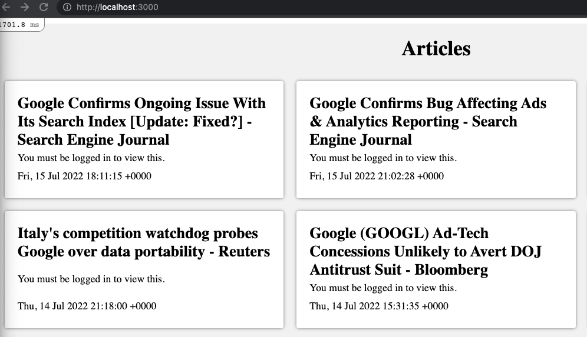

Notice in Rails server output, multiple queries to users table - because `logged_in?` helper methods invokes `current_user` method in ApplicationController, which runs a query against User model. So its one query per article. Instructor did not address this - performance issue?

```
Started GET "/" for ::1 at 2022-07-17 08:28:28 -0400
Processing by HomeController#index as HTML
  Rendering layout layouts/application.html.erb
  Rendering home/index.html.erb within layouts/application
  User Load (0.1ms)  SELECT "users".* FROM "users" WHERE "users"."id" IS NULL LIMIT ?  [["LIMIT", 1]]
  ↳ app/controllers/application_controller.rb:10:in `current_user'
  CACHE User Load (0.0ms)  SELECT "users".* FROM "users" WHERE "users"."id" IS NULL LIMIT ?  [["LIMIT", 1]]
  ↳ app/controllers/application_controller.rb:10:in `current_user'
  CACHE User Load (0.0ms)  SELECT "users".* FROM "users" WHERE "users"."id" IS NULL LIMIT ?  [["LIMIT", 1]]
  ↳ app/controllers/application_controller.rb:10:in `current_user'
  CACHE User Load (0.0ms)  SELECT "users".* FROM "users" WHERE "users"."id" IS NULL LIMIT ?  [["LIMIT", 1]]
  ↳ app/controllers/application_controller.rb:10:in `current_user'
  ...
```

Add `Login` link to home viw:

```erb
<!-- news/app/views/home/index.html.erb -->
<div class="articles">
  <h1>Articles</h1>

  <h2><a href="/home/login">Login</a></h2>

  <div class="articles">
    <% articles('Google').items.each do |item| %>
      <div class="article">
        <h2><%= item.title %></h2>
        <p><%= logged_in? ? (raw item.description) : "You must be logged in to view this." %></p>
        <p><%= item.pubDate %></p>
      </div>
    <% end %>
  </div>
</div>
```

Add if/else conditional to home view to display Logout link instead of Login if user already logged in:

```erb
<div class="articles">
  <h1>Articles</h1>

  <h2>
    <% if logged_in? %>
      <a href="/home/logout">Logout</a>
    <% else %>
      <a href="/home/login">Login</a>
    <% end %>
  </h2>

  <div class="articles">
    <% articles('Google').items.each do |item| %>
      <div class="article">
        <h2><%= item.title %></h2>
        <p><%= logged_in? ? (raw item.description) : "You must be logged in to view this." %></p>
        <p><%= item.pubDate %></p>
      </div>
    <% end %>
  </div>
</div>
```

Update `login` method in home controller to redirect to homepage after a successful login:

```ruby
# news/app/controllers/home_controller.rb
class HomeController < ApplicationController
  skip_before_action :authorized, only: [:login, :logout, :index]

  def index
  end

  def login
    if params["username"]
      user = User.find_by(username: params[:username])
      @valid = user.authenticate(params[:password])
      if @valid
        puts("=== authentication successful for #{user.username}, populating session with #{user.id}")
        session[:user_id] = user.id
        redirect_to '/'
      else
        puts("=== authentication failed for #{user.username}")
      end
    end
  end

  def logout
    session[:user_id] = nil
  end
end
```

### Encrypted Cookies